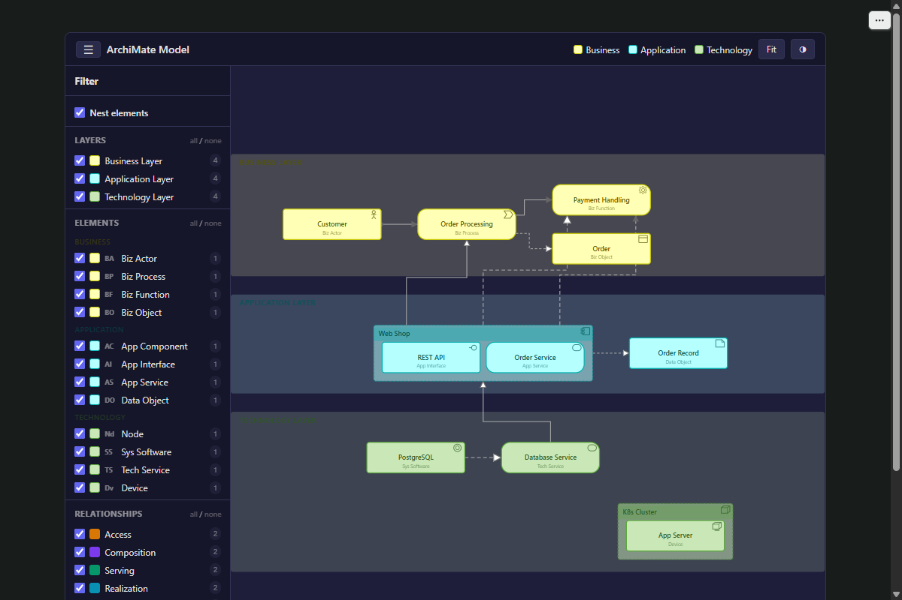

# anywidget-archimate

Interactive ArchiMate model viewer for Jupyter, Marimo, and VS Code notebooks.

Renders ArchiMate 3.0 Open Exchange Format XML with layered layout:
- **Yellow:** Business layer (top)
- **Blue:** Application layer (middle)
- **Green:** Technology layer (bottom)

Supports all 8 ArchiMate relationship types with correct arrow notation.



## Install

```bash
uv add anywidget-archimate
```

## Usage

```python
from anywidget_archimate import ArchiMate

# From an XML file
widget = ArchiMate.from_xml("model.xml")
widget
```

```python
# Or load later
widget = ArchiMate()
widget.load_xml("model.xml")
```

## Development

```bash
git clone https://github.com/StevenBtw/anywidget-archimate.git
cd anywidget-archimate
uv sync
uv run pytest
```

## License

Apache-2.0
